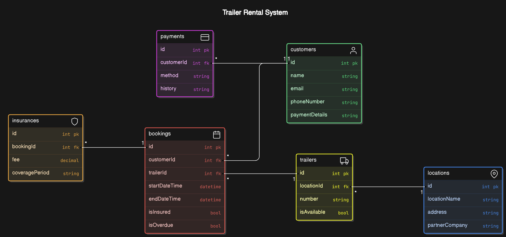

# MyTrailer Documentation

## Domain

### Entities

- **Trailer**
  - `Id`: Trailer identifier.
  - `LocationId`: Identifier for the location where the trailer is placed.
  - `Number`: Unique number of the trailer at the specific location.
  - `IsAvailable`: Boolean flag indicating whether the trailer is available for booking.

- **Location**
  - `Id`: Location identifier.
  - `LocationName`: Name of the location (e.g., "Jem og Fix").
  - `Address`: Physical address of the location.
  - `PartnerCompany`: The company that is associated with the location (for branding and other business agreements).

- **Customer**
  - `Id`: Customer identifier.
  - `Name`: Full name of the customer.
  - `Email`: Customer’s email for notifications and communication.
  - `PhoneNumber`: Customer’s phone number.
  - `Payments`: Collection of payment records for the customer.

- **Booking**
  - `Id`: Booking identifier.
  - `CustomerId`: Identifier for the customer making the booking.
  - `TrailerId`: Identifier for the trailer being booked.
  - `StartDateTime`: Start date and time of the booking.
  - `EndDateTime`: End date and time of the booking.
  - `IsInsured`: Boolean indicating whether insurance was purchased.
  - `IsOverdue`: Boolean indicating if the trailer was returned late.

## Value Objects

- **PaymentDetails**
  - `PaymentMethod`: Describes the method of payment used (e.g., "Credit Card").
  - `PaymentHistory`: Stores past payment transactions as a list.
  - **Behavior**: Tracks payment history and processes customer payments.

- **Insurance**
  - `BookingId`: The booking associated with this insurance.
  - `Fee`: Fixed fee for the insurance (50 Kr).
  - `CoveragePeriod`: The period for which the insurance is valid (e.g., 24 hours).
  - **Behavior**: Tracks insurance status and calculates coverage.

## Aggregates

- **Customer Aggregate**:
  - Attributes: Contains Customer, Booking, and Payments.
  - **Behavior**: Allows a customer to manage their bookings, payments, and insurance purchases.

- **Location Aggregate**:
  - Attributes: Contains Location and its associated Trailers.
  - **Behavior**: Manages the available trailers for a location, and checks availability based on bookings.

- **Trailer Aggregate**:
  - Attributes: Contains Trailer and its Bookings.
  - **Behavior**: Tracks trailer availability and manages bookings.

## User Stories

### User Story 1: View Available Trailers at a Selected Location

- **As a customer**, I want to view available trailers at my selected location, so that I can choose one for rental.
- **Given** the customer has opened the trailer booking page in the app,
- **When** they select a location,
- **Then** the system should display all available trailers for that location.

### User Story 2: Book a Trailer for Short-Term Rental

- **As a customer**, I want to book a trailer for short-term rental, so that I can move my items.
- **Given** a customer has selected a trailer and a valid time slot,
- **When** they confirm the booking,
- **Then** the system should register the booking and mark the trailer as unavailable for the chosen period.

### User Story 3: Purchase Insurance for the Trailer

- **As a customer**, I want to purchase insurance when booking a trailer, so that I am covered in case of damage.
- **Given** a customer is booking a trailer,
- **When** they are prompted to add insurance,
- **Then** the system should allow them to add insurance for a fee of 50 Kr.

### User Story 4: Charge a Late Return Fee

- **As a customer**, I want to receive a late return fee if I return the trailer after the scheduled time, so that I know the extra cost.
- **Given** a customer has returned a trailer after the booking's end time,
- **When** the system processes the return,
- **Then** it should apply an excess rental fee to the customer’s account.

### User Story 5: Book Long-Term Rentals via Website

- **As a customer**, I want to book long-term rentals for overnight use via the website, so that I can use the trailer overnight.
- **Given** a customer is trying to book an overnight rental,
- **When** they attempt to do this via the app,
- **Then** the system should direct them to the website to complete the booking.

### User Story 6: Display Branding on Trailers

- **As a location partner**, I want to have my branding displayed on trailers, so that customers can recognize my store.
- **Given** a trailer is located at a partner’s site,
- **When** a customer views the trailer details in the app,
- **Then** the system should display the partner’s branding along with MyTrailer branding.

### User Story 7: Track Trailer Usage and Late Returns

- **As a system administrator**, I want to track trailer usage and late returns, so that I can ensure trailers are available and customers are charged correctly.
- **Given** a trailer has been rented out,
- **When** the trailer is returned,
- **Then** the system should log the return time and calculate any late fees if applicable.
